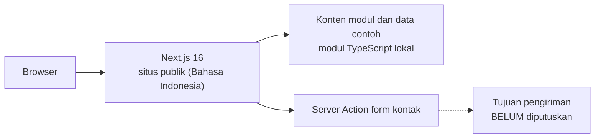
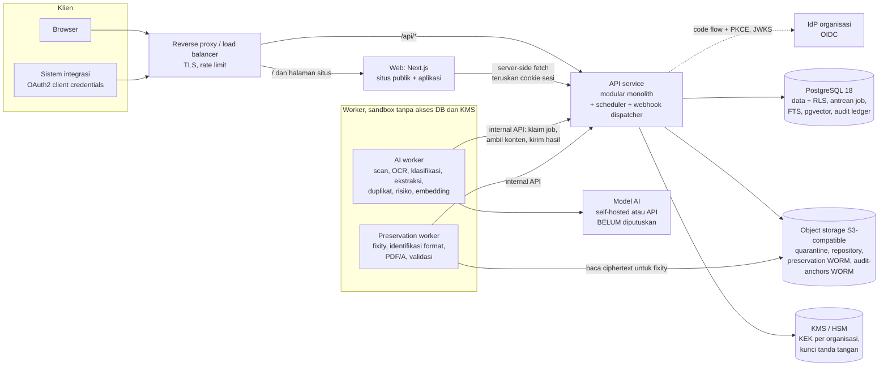
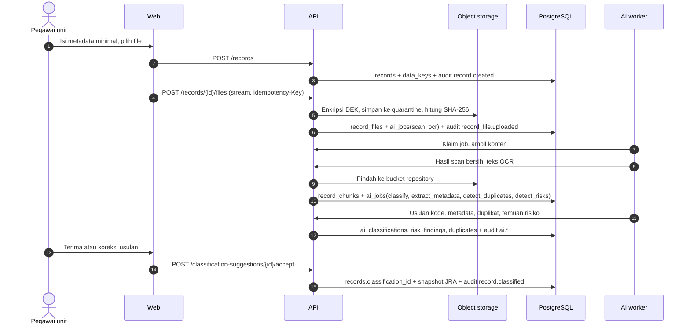

# ARCHITECTURE: Smart Records Center

Status dokumen: draf v0.1, 26 September 2026.
Legenda: **[ADA]** sudah ada/sedang dibangun, **[RENCANA]** target arsitektur, belum dibangun.

Dokumen terkait: `PRD.md` (requirement dan fase), `DATABASE.md` (skema), `API.md` (kontrak), `SECURITY.md` (kontrol keamanan).

## 1. Ringkasan

- **Sekarang [ADA]**: satu aplikasi Next.js berisi situs publik berbahasa Indonesia dengan layar produk berdata contoh. Tidak ada backend, database, atau AI.
- **Target [RENCANA]**: API service berbentuk modular monolith + worker, PostgreSQL sebagai system of record (sekaligus antrean job, full-text search, vektor, dan audit ledger pada MVP), object storage S3-compatible dengan Object Lock untuk arsip permanen dan checkpoint audit, serta KMS/HSM untuk kunci.
- Prinsip: sesedikit mungkin komponen yang harus dioperasikan, karena hosting (cloud atau on-prem) belum diputuskan dan organisasi teregulasi sering menjalankan sendiri.

## 2. Kondisi saat ini (Fase 0) [ADA]



- Situs publik berbahasa Indonesia tanpa segmen bahasa. Versi English menyusul (keputusan pemilik, 26 Sep 2026); saat itu routing bahasa ditambahkan.
- Semua halaman publik statis (SSG), kecuali `/terima-kasih` yang dirender per permintaan dan `noindex`.
- Demo app ditunda. Layar produk di situs dibuat dengan komponen (`src/components/product/*`) dan data contoh berlabel "Data contoh".
- Register audit contoh diverifikasi dengan SHA-256 sungguhan di browser (`src/lib/chain.ts`).

### Struktur folder frontend

```
src/
  app/
    layout.tsx                  # <html lang="id">, font, header, footer, cookie consent
    globals.css                 # Tailwind v4 + token (lihat DESIGN-SYSTEM.md)
    page.tsx                    # beranda
    platform/page.tsx           # ikhtisar platform
    platform/cara-kerja/        # siklus hidup arsip
    platform/arsitektur/        # arsitektur & integrasi
    platform/keamanan/          # keamanan & kepatuhan
    modul/page.tsx              # indeks modul
    modul/[slug]/page.tsx       # 5 halaman modul (SSG dari src/lib/modules.ts)
    solusi/  mengapa-kami/  tentang-kami/
    kontak/                     # form + Server Action + skema zod
    terima-kasih/               # noindex, conversion ping
    kebijakan-privasi/  syarat-ketentuan/
    not-found.tsx  error.tsx  global-error.tsx
    robots.ts  sitemap.ts  manifest.ts  opengraph-image.tsx  icon.*  apple-icon.tsx
  components/
    ui/                         # komponen shadcn/ui (Base UI)
    product/                    # layar produk + register dan ekstraksi interaktif
    header-nav.tsx  site-footer.tsx  section.tsx  ...
  lib/
    site.ts                     # identitas situs, navigasi, placeholder [DATA ASLI]
    modules.ts                  # isi 5 modul
    sample.ts                   # data contoh
    chain.ts                    # rantai hash register audit
    contact-schema.ts           # validasi form kontak
```

## 3. Target arsitektur [RENCANA]



Batas kepercayaan utama:

1. Internet → reverse proxy (TLS, rate limit).
2. Web → API (sesi pengguna; Web tidak punya akses database).
3. API → PostgreSQL, object storage, KMS (hanya API yang memegang kredensial ini).
4. API ↔ worker (jaringan internal, autentikasi service; worker memproses konten tidak tepercaya).
5. Worker → model AI (satu-satunya egress worker).

## 4. Komponen

| Komponen | Tanggung jawab | Teknologi usulan | Fase |
|---|---|---|---|
| Web | Situs publik, UI aplikasi, render server-side, form kontak | Next.js 16, TypeScript, Tailwind v4, shadcn/ui (Base UI), Motion | F0 [ADA], aplikasi F1 |
| API service | Auth dan sesi, aturan domain (lifecycle, ABAC, retensi), penulisan audit, antrean job, scheduler, webhook, internal API untuk worker | TypeScript (Node.js), OpenAPI 3.1 sebagai kontrak | F1 |
| PostgreSQL | System of record, RLS tenant, antrean job, FTS, vektor, audit ledger | PostgreSQL 18 + ltree, pg_trgm, btree_gist, pgvector | F1 (pgvector F2) |
| Object storage | Konten file terenkripsi, versi, WORM untuk permanen dan checkpoint audit | S3-compatible (MinIO untuk on-prem atau layanan cloud setara) | F1 |
| KMS/HSM | KEK per organisasi, kunci tanda tangan checkpoint | Bergantung hosting: KMS cloud, HSM, atau Vault Transit | F1 |
| AI worker | Scan malware, OCR, klasifikasi, ekstraksi metadata, duplikat, risiko, embedding | Python; ClamAV; engine OCR belum diputuskan | F1 (sebagian), F2 |
| Preservation worker | Fixity, identifikasi format, migrasi PDF/A, validasi | Container berisi Siegfried (PRONOM), veraPDF, konverter headless | F1 (fixity), F2 |
| Search | Full-text dan semantic | F1: PostgreSQL FTS (`indonesian`, `english`) + pg_trgm; F2: pgvector hybrid; F3: OpenSearch bila perlu | F1 s.d. F3 |
| Observabilitas | Trace, metrik, log | OpenTelemetry; backend observabilitas mengikuti hosting | F1 |

### 4.1 Web (Next.js)

- Halaman publik statis; halaman aplikasi dirender dinamis karena bergantung sesi dan CSP bernonce.
- Tidak menyimpan kredensial dan tidak mengakses database. Server Component memanggil API dengan meneruskan cookie sesi pengguna.
- Web dan API berada di origin yang sama di belakang reverse proxy (`/api/*` → API), sehingga cookie sesi `__Host-` dapat dipakai tanpa CORS.

### 4.2 API service

- Satu deployable dengan modul: `identity`, `governance` (kebijakan, BCS, retensi, legal hold), `repository`, `lifecycle` (transisi, batch, berita acara), `ai` (job, usulan, review), `search`, `preservation`, `audit`, `webhooks`.
- Satu fungsi kebijakan akses (`can(user, action, record)`) dipakai semua endpoint, dan versi SQL-nya dipakai untuk daftar dan pencarian (pre-filter).
- Satu-satunya komponen yang menulis ke database dan memegang akses KMS. Worker mengirim hasil lewat internal API, sehingga aturan domain dan penulisan audit ada di satu tempat.
- Scheduler berjalan di dalam API dengan leader lock (`pg_try_advisory_lock`), bukan proses terpisah.

### 4.3 Antrean job

- Tabel `ai_jobs` di PostgreSQL. API mengklaim job dengan `SELECT ... FOR UPDATE SKIP LOCKED` saat worker memanggil `POST /internal/jobs/claim`.
- Retry dengan backoff eksponensial sampai `max_attempts`, lalu status `failed` + alert.
- Idempoten: indeks unik mencegah dua job terbuka untuk `(file_id, type)` yang sama; hasil ditulis dengan kunci `(job_id)`.

### 4.4 Object storage

| Bucket | Isi | Proteksi |
|---|---|---|
| `quarantine` | Upload yang belum lolos scan | Lifecycle hapus otomatis 7 hari; tidak pernah disajikan ke pengguna |
| `repository` | Arsip aktif/inaktif, terenkripsi DEK per arsip | Versioning aktif; tanpa Object Lock karena dapat dimusnahkan |
| `preservation` | Arsip permanen (asli + PDF/A) | Object Lock mode compliance, masa retensi panjang; tidak dapat dihapus siapa pun |
| `audit-anchors` | Checkpoint rantai audit bertanda tangan, arsip partisi audit | Object Lock mode compliance |

Konten dienkripsi di aplikasi sebelum masuk storage (envelope encryption, `SECURITY.md` bagian 4). Enkripsi sisi server storage tetap diaktifkan sebagai lapisan tambahan.

### 4.5 AI worker

- Worker adalah compute tanpa status: klaim job → ambil konten plaintext lewat internal API (API yang mendekripsi) → proses → kirim hasil. Worker tidak memegang KEK maupun kredensial database.
- Sandbox: container tanpa hak root, filesystem read-only, batas CPU/memori/waktu, egress hanya ke endpoint model.
- **Klasifikasi**: model menerima teks dokumen + daftar kode BCS yang dapat dipakai beserta deskripsinya; output dibatasi JSON schema (kode dari enum yang valid, confidence, alasan). Setelah organisasi punya cukup arsip berlabel, kNN atas embedding arsip terklasifikasi dipakai sebagai sinyal tambahan. Confidence dari LLM tidak terkalibrasi, karena itu auto-apply nonaktif sampai ada validasi per organisasi.
- **Ekstraksi metadata**: field per jenis arsip, setiap nilai membawa confidence dan lokasi bukti (halaman, kotak).
- **Duplikat**: SHA-256 persis (F1); simhash teks, perceptual hash, dan kemiripan embedding (F2).
- **Risiko**: regex + validasi struktur untuk NIK (16 digit: kode wilayah, tanggal lahir dengan +40 untuk perempuan, nomor urut) dan NPWP (15 digit format lama, 16 digit format baru); detektor kontak dan data keuangan; model untuk data pribadi spesifik (F2). Bukti selalu disamarkan sebelum disimpan.
- Setiap output mencatat `model_ref` (nama@versi) dan masuk audit sebagai `actor_type = ai`.

### 4.6 Preservation

Mengacu model OAIS (ISO 14721) sebagai referensi, bukan klaim kepatuhan:

| Konsep OAIS | Di SRC |
|---|---|
| SIP (Submission Information Package) | Upload + metadata capture |
| AIP (Archival Information Package) | File asli + salinan preservasi + metadata + `preservation_events` |
| DIP (Dissemination Information Package) | Salinan akses, unduhan, paket bukti audit |

- **Fixity rutin** memeriksa hash ciphertext (`ciphertext_sha256`) langsung di storage tanpa dekripsi, bergilir sehingga setiap objek diperiksa minimal sekali per 90 hari (target). Pemeriksaan hash plaintext (`sha256`) dilakukan saat migrasi, ekspor, dan sampling berkala lewat internal API.
- **Migrasi format**: konversi ke PDF/A-2b di sandbox tanpa jaringan, validasi dengan veraPDF, hasil disimpan sebagai `record_files.role = 'preservation'` yang menunjuk file asli. File asli tidak pernah dihapus.
- Kegagalan fixity → event `failure`, temuan, alert, dan (F3) pemulihan dari replika.

### 4.7 Audit ledger

- Tabel `audit_events` append-only, berpartisi bulanan, hash chain per organisasi yang diisi trigger database (`DATABASE.md` bagian 11).
- Event ditulis dalam transaksi yang sama dengan perubahan bisnis.
- Checkpoint kepala rantai ditandatangani (Ed25519, kunci di KMS/HSM) dan ditulis ke bucket `audit-anchors` (target tiap jam). F3: timestamp RFC 3161.
- Verifikasi: job terjadwal harian + endpoint on-demand; hasilnya sendiri dicatat sebagai event `audit.verified`.

## 5. Alur end-to-end

### 5.1 Capture sampai terklasifikasi



### 5.2 Retensi sampai disposisi

1. **Tutup berkas**: `POST /records/{id}/close` mengisi `closed_at`; `retention_start` diisi, `active_until` dan `inactive_until` terhitung otomatis (kolom generated). Audit `record.closed`.
2. **Jatuh tempo aktif**: scheduler harian mencari `status = 'active' AND active_until <= today` lalu membuat draf batch `transfer_inactive`.
3. **Pemindahan inaktif**: records manager meninjau, mengajukan; approver menyetujui; eksekusi mengubah status ke `inactive`, `custodian_unit_id` ke record center, membuat berita acara pemindahan. Audit per arsip `record.status_changed`.
4. **Jatuh tempo inaktif**: scheduler mencari `status = 'inactive' AND inactive_until <= today AND NOT legal_hold` lalu membuat draf batch `final` dengan keputusan awal dari `nasib_akhir` (`musnah` → `destroy`, `permanen` → `make_permanent`, `dinilai_kembali` → wajib dipilih reviewer).
5. **Pengajuan**: arsip dalam batch `final` berpindah ke `pending_disposition`. Legal hold baru pada arsip ini mengeluarkannya dari batch dan mengembalikannya ke `inactive`.
6. **Persetujuan**: approver (bukan pembuat batch) menyetujui atau menolak. Ditolak → semua item kembali `inactive`.
7. **Eksekusi** (job asinkron, idempoten per item):
   - Validasi ulang setiap item: status, legal hold, vital, nasib akhir, jumlah persetujuan.
   - Buat berita acara PDF dari snapshot item, simpan sebagai arsip baru, catat hash.
   - `destroy`: hapus `record_chunks`, nilai `metadata_extractions`, sampel bukti risiko, sidik duplikat; hancurkan DEK (`data_keys.wrapped_dek = NULL`); hapus semua versi objek; status `disposed`. Audit `record.destroyed` berisi daftar SHA-256 file yang dimusnahkan.
   - `make_permanent`: salin ke bucket `preservation` (WORM), jadwalkan migrasi PDF/A (F2), status `permanent`.
   - `extend_retention`: tambah `retensi_inaktif_tahun`, status kembali `inactive`.
   - `exclude`: status kembali `inactive`.
8. **Bukti**: batch `executed`; paket bukti dapat diekspor (F2).

## 6. Keputusan desain dan trade-off

| # | Keputusan | Alasan | Trade-off | Tinjau ulang bila |
|---|---|---|---|---|
| D1 | API modular monolith + worker, bukan microservices | Tim kecil, deploy on-prem harus sederhana, transaksi domain + audit harus atomik | Skala per modul tidak independen | Satu modul butuh skala atau siklus rilis berbeda |
| D2 | PostgreSQL untuk antrean, FTS, vektor, dan audit pada MVP | Satu komponen stateful untuk dioperasikan, backup, dan diamankan | Batas skala search dan throughput antrean lebih rendah dari sistem khusus | p95 search melewati target atau korpus melampaui asumsi skala |
| D3 | API terpisah dari Next.js | Integrasi, worker, dan klien non-browser butuh kontrak stabil; batas keamanan jelas; Web dapat di-scale terpisah | Dua deployable | Tidak perlu ditinjau |
| D4 | Hanya API yang mengakses DB dan KMS; worker lewat internal API | Aturan domain dan audit di satu tempat; worker yang memproses file tidak tepercaya tidak memegang rahasia | Konten plaintext mengalir lewat API (beban bandwidth) | Bandwidth API menjadi bottleneck; opsi: token dekripsi per job berumur pendek |
| D5 | Audit hash chain sinkron dalam transaksi bisnis | Tidak ada celah antara perubahan dan bukti | Penulisan serial per organisasi | Kontensi kunci `audit_heads` terukur; opsi: outbox + ledger writer |
| D6 | Envelope encryption dengan DEK per arsip sejak hari pertama | Crypto-shredding untuk pemusnahan; membatasi dampak kebocoran storage; sulit ditambahkan belakangan | Kompleksitas manajemen kunci; streaming AEAD | Tidak perlu ditinjau |
| D7 | Snapshot JRA di arsip | Perubahan JRA tidak mengubah arsip lama diam-diam; berita acara akurat | Perhitungan ulang perlu fitur eksplisit | Tidak perlu ditinjau |
| D8 | Tidak ada DELETE arsip; keluar hanya lewat disposisi | Setiap penghapusan punya persetujuan dan bukti | Salah input butuh proses batch | Pilot menunjukkan beban nyata; opsi: status `void` khusus arsip tanpa file dalam 24 jam |
| D9 | Auto-apply AI nonaktif default; disposisi selalu manusia | Confidence LLM tidak terkalibrasi; kesalahan klasifikasi tidak boleh berujung pemusnahan | Lebih banyak kerja review di awal | Presisi terukur per organisasi ≥ target |
| D10 | TypeScript untuk API, Python untuk worker | Tipe dan enum sama dengan frontend; ekosistem OCR/ML ada di Python | Dua bahasa, dua toolchain | Tim memilih satu bahasa |
| D11 | Upload di-stream lewat API (bukan presigned URL) pada MVP | Hash, enkripsi, dan karantina di satu jalur; tidak ada URL tulis yang bocor | Tanpa resume untuk file besar; bandwidth API | File > ~2 GB umum atau koneksi kantor daerah lambat; opsi: multipart presigned ke `quarantine` |
| D12 | UUIDv7 untuk semua ID | Urut waktu, ramah indeks B-tree, aman diekspos | Waktu pembuatan terbaca dari ID | Tidak perlu ditinjau |
| D13 | Multi-tenant dengan `organization_id` + RLS, tetapi bisa deploy single-tenant | Hosting belum diputuskan; satu kode untuk dua model | RLS menambah disiplin pada setiap query | Keputusan hosting final |
| D14 | Pencarian menerapkan filter akses di dalam query (pre-filter) | Tidak ada kebocoran judul/snippet/jumlah hasil | Query lebih kompleks; perlu iterative scan untuk vektor | Tidak perlu ditinjau |
| D15 | PDF/A-2b sebagai format preservasi, file asli selalu disimpan | Standar terbuka yang umum; migrasi dapat diulang dengan tool lebih baik | Penyimpanan ganda untuk arsip permanen | Jenis arsip non-dokumen (video, CAD) menjadi signifikan |

## 7. Deployment [RENCANA, bergantung keputusan hosting]

- Semua komponen dikemas sebagai image container (OCI). Target: artefak yang sama berjalan di cloud maupun on-prem.
- Lingkungan: `dev`, `staging`, `prod`. Staging memakai data sintetis, bukan salinan produksi.
- Orkestrasi: Docker Compose cukup untuk pilot; Kubernetes untuk ketersediaan tinggi (F3). Pilihan akhir menunggu keputusan hosting.
- Backup: PostgreSQL base backup + WAL archiving ke object storage (PITR). Objek: versioning + replikasi ke lokasi kedua (F3). Uji restore terjadwal minimal per kuartal.
- Konfigurasi dan rahasia lewat environment/secret manager; tidak ada rahasia di image atau repo.

## 8. Struktur repo backend (usulan)

Belum dibuat. Usulan agar tidak mengganggu aplikasi Next.js yang ada di root:

```
services/api/          # API service (TypeScript)
services/worker/       # AI + preservation worker (Python)
db/migrations/         # SQL forward-only, sumber kebenaran skema
openapi/openapi.yaml   # kontrak API; tipe TypeScript dihasilkan dari sini
```

Enum di frontend (data contoh) dan API sebaiknya dihasilkan dari satu sumber (OpenAPI) setelah F1 dimulai. Sebelum itu, salin dari `DATABASE.md` bagian 16.
