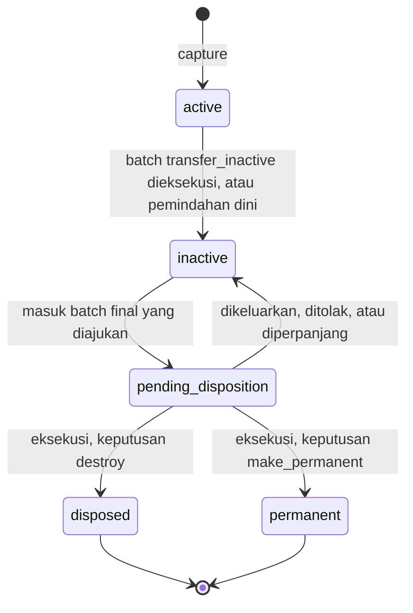

# PRD: Smart Records Center

Status dokumen: draf v0.1, 26 September 2026. Pemilik produk: [DATA ASLI].

Legenda status di seluruh dokumen:

- **[ADA]**: sudah ada atau sedang dibangun di repo ini.
- **[RENCANA]**: belum dibangun; target arsitektur.

Semua angka di dokumen ini adalah **target atau asumsi kerja**, bukan hasil pengukuran. Saat ini belum ada pelanggan, sertifikasi, maupun statistik yang boleh diklaim.

Dokumen terkait: `ARCHITECTURE.md`, `DATABASE.md`, `API.md`, `SECURITY.md`.

## 1. Ringkasan

Smart Records Center (SRC) adalah platform records management untuk organisasi teregulasi di Indonesia: instansi pemerintah, BUMN, bank, dan korporasi besar. SRC menjalankan seluruh siklus hidup arsip di bawah aturan tata kelola: arsip ditangkap ke repository, diklasifikasikan menurut BCS, diberi aturan retensi (JRA) dan akses, dipindah Aktif → Inaktif → Permanen atau Musnah, dipreservasi secara digital, dan meninggalkan bukti audit di setiap langkah.

Governance dan AI adalah satu pipeline, bukan fitur tambahan: aturan (BCS, retensi, akses, disposisi) diterapkan otomatis ke setiap arsip, dan setiap keputusan otomatis dicatat sebagai bukti audit (append-only, hash chain).

```
SMART RECORDS CENTER
├─ INFORMATION GOVERNANCE: Policy, BCS, Retention (JRA), Access, Disposition
├─ AI & AUTOMATION: Classification, Metadata extraction, OCR/AI search, Duplicate detection, Risk detection
├─ RECORDS REPOSITORY: Active / Inactive / Permanent records
├─ DIGITAL PRESERVATION
└─ AUDIT & EVIDENCE
```

## 2. Status saat ini

| Komponen | Status | Catatan |
|---|---|---|
| Situs publik Bahasa Indonesia (`/`, `/platform` + 3 subhalaman, `/modul` + 5 modul, `/solusi`, `/mengapa-kami`, `/tentang-kami`, `/kontak`, `/terima-kasih`, `/kebijakan-privasi`, `/syarat-ketentuan`) | [ADA] | Next.js 16 App Router, TypeScript, Tailwind v4, shadcn/ui (Base UI), Motion. Versi English menyusul |
| Demo app dengan data contoh | [RENCANA] ditunda | Diputuskan pemilik 26 Sep 2026: fokus website dulu. Layar produk di situs sudah memakai data contoh berlabel |
| Form kontak | [ADA] sebagian | Validasi server; tujuan pengiriman (email/CRM) belum ditentukan |
| API service, PostgreSQL, object storage, worker AI, preservation, audit ledger | [RENCANA] | Lihat `ARCHITECTURE.md` |
| Integrasi eksternal | [RENCANA] | Belum ada yang diputuskan; lihat open questions |

## 3. Masalah

1. Arsip tersebar di file share, email, aplikasi unit, dan kertas. Tidak ada satu sumber kebenaran.
2. BCS dan JRA ada sebagai dokumen kebijakan, tetapi penerapannya manual per arsip. Hasilnya tidak konsisten dan jatuh tempo retensi terlewat.
3. Penyusutan (pemindahan inaktif, pemusnahan, penyerahan permanen) lambat. Daftar usulan dan berita acara disusun manual dan sulit dibuktikan saat audit.
4. Akses diatur per folder, bukan per tingkat keamanan dan unit. Sulit menjawab "siapa boleh melihat apa" dan "siapa sudah melihat apa".
5. Data pribadi (NIK, NPWP, data kesehatan, dll.) tersimpan tanpa inventaris, menambah risiko terhadap kewajiban UU PDP.
6. Arsip digital jangka panjang rentan: format usang, kerusakan bit, tanpa pemeriksaan fixity.
7. Log aplikasi biasa bisa diubah admin, sehingga lemah sebagai bukti.

## 4. Tujuan dan non-goal

### Tujuan

| ID | Tujuan |
|---|---|
| G1 | Setiap arsip yang masuk punya kode klasifikasi, aturan retensi, tingkat keamanan, dan unit pemilik, dengan usulan AI dan konfirmasi manusia. |
| G2 | Siklus Aktif → Inaktif → Permanen/Musnah digerakkan jadwal, bukan ingatan staf. |
| G3 | Setiap keputusan, manusia maupun otomatis, tercatat sebagai bukti audit yang dapat diverifikasi pihak ketiga. |
| G4 | Arsip permanen terjaga keaslian (fixity) dan keterbacaannya (format preservasi). |
| G5 | Situs publik menjelaskan lifecycle dengan jelas dan menghasilkan permintaan demo/konsultasi. |

### Non-goal

- Bukan editor dokumen kolaboratif atau pengganti office suite/DMS kolaborasi.
- Bukan aplikasi tata naskah dinas/persuratan. "Disposisi" di SRC berarti disposition menurut ISO 15489 (penyusutan), bukan disposisi surat pimpinan.
- AI tidak pernah memutuskan pemusnahan atau penyerahan. Keputusan akhir selalu manusia.
- Bukan manajemen gudang arsip fisik (lokasi rak/boks) pada MVP.
- Tidak mengklaim kepatuhan atau sertifikasi apa pun. Standar disebut sebagai rujukan desain.
- Bukan nasihat hukum. Penyusunan BCS dan JRA tetap tanggung jawab organisasi.

## 5. Glosarium

| Istilah | Arti di SRC |
|---|---|
| Arsip / record | Unit informasi yang dikelola: metadata + satu atau lebih file berversi. |
| BCS / klasifikasi arsip | Skema hierarkis kode fungsi → kegiatan → transaksi, mis. `KU` → `KU.01` → `KU.01.02` (contoh ilustratif). |
| JRA | Jadwal Retensi Arsip: per kode klasifikasi berisi retensi aktif (tahun), retensi inaktif (tahun), dan nasib akhir. |
| Nasib akhir | `permanen`, `musnah`, atau `dinilai_kembali`. |
| Unit pengolah | Unit yang menciptakan arsip dan menyimpannya selama aktif. |
| Unit kearsipan / record center | Unit penyimpan arsip inaktif (`units.is_records_center`). |
| Penyusutan / disposisi | Pemindahan ke inaktif, pemusnahan, atau penetapan permanen; lewat batch dengan persetujuan (kecuali pemindahan dini ke inaktif oleh records manager dengan alasan). |
| Berita acara | Dokumen resmi hasil eksekusi batch; disimpan sendiri sebagai arsip. |
| Arsip vital | Arsip yang esensial untuk kelangsungan organisasi (`is_vital`). |
| Legal hold | Penangguhan penyusutan karena perkara, pemeriksaan, atau permintaan hukum. |
| Fixity | Pemeriksaan hash berkala untuk membuktikan file tidak berubah. |
| Hash chain | Rantai event audit: setiap event memuat hash event sebelumnya. |

## 6. Persona

| Persona | Kebutuhan utama | Peran sistem |
|---|---|---|
| Arsiparis / records manager | Mengelola BCS dan JRA, memastikan arsip terklasifikasi, menyusun usulan penyusutan, memantau preservasi. | `records_manager` |
| Compliance / legal | Memasang legal hold, menindaklanjuti temuan data pribadi, memastikan kebijakan diterapkan. | `compliance_officer` |
| Auditor (internal/eksternal) | Menelusuri siapa melakukan apa, memverifikasi integritas log, mengekspor bukti. Hanya baca. | `auditor` |
| Pegawai unit pengolah | Mengunggah arsip dengan usaha minimal, menemukan arsip unitnya, mengonfirmasi usulan AI. | `unit_staff` |
| Admin TI | Menghubungkan SSO, mengelola unit/pengguna/peran, integrasi. Tidak otomatis bisa membaca isi arsip. | `admin` |
| Pejabat berwenang | Menyetujui atau menolak usulan penyusutan. Bukan pengguna harian, tetapi wajib di alur disposisi. | `approver` |

## 7. Lifecycle arsip (acuan semua modul)

Enum status (dipakai di database, API, dan data contoh UI):

| Nilai | Label ID | Arti |
|---|---|---|
| `active` | Aktif | Masih dipakai unit pengolah. Termasuk arsip yang belum diklasifikasi. |
| `inactive` | Inaktif | Retensi aktif habis, disimpan di record center. |
| `pending_disposition` | Menunggu penyusutan | Retensi inaktif habis dan masuk batch final yang sudah diajukan. |
| `permanent` | Permanen | Ditetapkan permanen; dipreservasi tanpa batas waktu. Status akhir. |
| `disposed` | Musnah | Konten dimusnahkan; metadata dan jejak audit tetap ada. Status akhir. |



Aturan lifecycle:

- **Perhitungan retensi**: `active_until = retention_start + retensi_aktif_tahun`; `inactive_until = active_until + retensi_inaktif_tahun`. `retention_start` = tanggal berkas ditutup (default), tanggal arsip, atau tanggal event, sesuai aturan. Berkas yang belum ditutup tetap `active`.
- **Snapshot**: aturan JRA disalin ke arsip saat diklasifikasi. Perubahan JRA berlaku untuk arsip baru; perhitungan ulang arsip lama adalah aksi eksplisit dengan pratinjau dampak dan jejak audit.
- **Semua perpindahan status lewat batch** dengan persetujuan, kecuali pemindahan dini ke inaktif oleh records manager dengan alasan tertulis.
- **Legal hold** memblokir `inactive → pending_disposition` dan `pending_disposition → disposed`. Hold yang dipasang saat arsip `pending_disposition` otomatis mengeluarkan arsip dari batch.
- **Nasib akhir** `permanen` tidak dapat diberi keputusan `destroy`. `dinilai_kembali` wajib diputuskan saat review batch: `destroy`, `make_permanent`, atau `extend_retention`.
- **Arsip vital** tidak dapat dimusnahkan selama flag vital aktif. Mencabut flag butuh alasan dan tercatat di audit.
- **Musnah** berarti konten dan turunannya (teks OCR, embedding, nilai metadata hasil ekstraksi) dihapus dan kunci enkripsinya dihancurkan. Metadata inti, berita acara, dan jejak audit dipertahankan sebagai bukti.
- Aturan di atas ditegakkan di API dan diulang sebagai trigger database (`DATABASE.md` bagian 9).

## 8. User stories

Format: sebagai [persona], saya ingin [aksi], agar [hasil].

### 8.1 Information Governance

| ID | Story |
|---|---|
| GOV-US1 | Sebagai records manager, saya ingin mengimpor BCS dan JRA dari spreadsheet dengan mode uji coba (dry run), agar tidak mengetik ulang ratusan kode dan kesalahan terlihat sebelum disimpan. |
| GOV-US2 | Sebagai records manager, saya ingin melihat dampak perubahan JRA (jumlah arsip terdampak dan tanggal baru) sebelum menerapkannya, agar perubahan tidak mengejutkan. |
| GOV-US3 | Sebagai compliance officer, saya ingin setiap aturan retensi dan akses menunjuk dasar kebijakan atau regulasinya, agar bisa dipertanggungjawabkan saat audit. |
| GOV-US4 | Sebagai compliance officer, saya ingin memasang legal hold pada sekumpulan arsip terkait perkara, agar tidak ada yang dimusnahkan selama pemeriksaan. |
| GOV-US5 | Sebagai admin, saya ingin mengatur akses berdasarkan peran, unit, dan tingkat keamanan, agar tidak perlu mengelola izin per folder. |
| GOV-US6 | Sebagai records manager, saya ingin sistem menyusun draf usulan pemindahan dan penyusutan dari arsip yang jatuh tempo, agar tidak menelusuri manual. |
| GOV-US7 | Sebagai pejabat berwenang, saya ingin meninjau daftar usulan beserta dasar JRA tiap arsip lalu menyetujui atau menolak, agar keputusan saya terdokumentasi. |

### 8.2 AI & Automation

| ID | Story |
|---|---|
| AI-US1 | Sebagai pegawai unit, saya ingin mengunggah dokumen dan langsung melihat usulan kode klasifikasi dan metadata yang sudah terisi, agar cukup mengonfirmasi. |
| AI-US2 | Sebagai records manager, saya ingin antrean review usulan AI dengan confidence, alasan singkat, dan lokasi bukti di dokumen, agar bisa menerima atau mengoreksi dengan cepat. |
| AI-US3 | Sebagai pegawai, saya ingin mencari dengan kata kunci atau kalimat biasa dan menemukan dokumen hasil pindaian (OCR), hanya yang saya berhak lihat. |
| AI-US4 | Sebagai records manager, saya ingin diberi tahu bila arsip yang diunggah identik atau mirip dengan arsip yang sudah ada, agar tidak menyimpan ganda. |
| AI-US5 | Sebagai compliance officer, saya ingin daftar arsip yang memuat NIK/NPWP atau data pribadi spesifik, terutama yang tingkat keamanannya terlalu rendah, agar bisa ditindaklanjuti. |

### 8.3 Records Repository

| ID | Story |
|---|---|
| REP-US1 | Sebagai pegawai unit, saya ingin membuat arsip dengan metadata minimal (judul, tanggal, unit) lalu mengunggah file, agar capture tidak menjadi beban. |
| REP-US2 | Sebagai pegawai unit, saya ingin mengunggah versi baru tanpa kehilangan versi lama, agar riwayat dokumen utuh. |
| REP-US3 | Sebagai records manager, saya ingin melihat timeline satu arsip: status, tanggal jatuh tempo, keputusan AI dan manusia, agar paham posisinya dalam lifecycle. |
| REP-US4 | Sebagai records manager, saya ingin memindahkan arsip yang jatuh tempo aktif ke record center secara batch, agar pemindahan inaktif tercatat rapi. |
| REP-US5 | Sebagai records manager, saya ingin menandai arsip vital, agar tidak ikut dimusnahkan dan mudah dipulihkan saat darurat. |

### 8.4 Digital Preservation

| ID | Story |
|---|---|
| PRS-US1 | Sebagai records manager, saya ingin laporan fixity berkala dan peringatan saat ada file yang hash-nya tidak cocok, agar kerusakan terdeteksi dini. |
| PRS-US2 | Sebagai records manager, saya ingin arsip permanen memiliki salinan PDF/A dengan file asli tetap tersimpan, agar tetap terbaca jangka panjang. |
| PRS-US3 | Sebagai auditor, saya ingin melihat riwayat preservasi satu file (identifikasi format, validasi, fixity, migrasi), agar keaslian bisa dinilai. |

### 8.5 Audit & Evidence

| ID | Story |
|---|---|
| AUD-US1 | Sebagai auditor, saya ingin melihat siapa melakukan apa pada satu arsip, termasuk keputusan AI beserta versi modelnya, agar setiap perubahan dapat ditelusuri. |
| AUD-US2 | Sebagai auditor, saya ingin memverifikasi integritas log untuk rentang waktu tertentu dan mendapat laporan, agar yakin log tidak diubah. |
| AUD-US3 | Sebagai auditor, saya ingin mengekspor paket bukti untuk satu batch penyusutan (daftar arsip, persetujuan, berita acara, event, hash), agar bisa diperiksa di luar sistem. |
| AUD-US4 | Sebagai compliance officer, saya ingin melihat siapa mengakses arsip rahasia dalam periode tertentu, agar akses tidak wajar terdeteksi. |

### 8.6 Administrasi

| ID | Story |
|---|---|
| ADM-US1 | Sebagai admin TI, saya ingin menghubungkan IdP organisasi lewat OIDC, agar pengguna masuk dengan akun kantor. |
| ADM-US2 | Sebagai admin TI, saya ingin mengelola hierarki unit dan penugasan peran, dan pengguna yang dinonaktifkan kehilangan akses segera. |

### 8.7 Situs publik dan demo (Fase 0)

| ID | Story |
|---|---|
| WEB-US1 | Sebagai pengambil keputusan, saya ingin memahami lifecycle arsip dan hubungan governance dengan AI pada kunjungan pertama, lalu meminta demo. |
| WEB-US2 | Sebagai pengunjung, saya ingin berganti bahasa ID/EN di halaman mana pun dan tetap di halaman yang sama. |
| WEB-US3 | Sebagai calon pengguna, saya ingin menjelajah demo app (arsip, retensi, penyusutan, audit) dengan data contoh yang jelas berlabel, agar bisa membayangkan penggunaannya. |

## 9. Requirement fungsional

Kolom Fase: F0 = sekarang, F1 = MVP, F2 = fase 2, F3 = fase 3.

### 9.1 Information Governance

| ID | Requirement | Fase |
|---|---|---|
| GOV-01 | Registri kebijakan: kode, judul, versi, status (`draft`, `approved`, `retired`), tanggal berlaku, dokumen kebijakan disimpan sebagai arsip. | F1 |
| GOV-02 | Kelola BCS hierarkis: kode, judul ID/EN, deskripsi, node pengelompok vs kode yang dapat dipakai, status `active`/`retired`. Kode tidak dihapus, hanya di-retire. | F1 |
| GOV-03 | Import BCS + JRA dari CSV/XLSX dengan dry run dan laporan error per baris. | F1 |
| GOV-04 | JRA per kode: `retensi_aktif_tahun`, `retensi_inaktif_tahun`, `nasib_akhir`, pemicu retensi (`closed`, `created`, `event`). | F1 |
| GOV-05 | Override retensi per unit atau berbasis event dengan dasar hukum wajib; database mencegah aturan tumpang tindih. | F2 |
| GOV-06 | Pratinjau dampak dan perhitungan ulang retensi massal, dengan persetujuan dan jejak audit. | F2 |
| GOV-07 | Akses: RBAC (peran × lingkup unit) + ABAC (tingkat keamanan × clearance × kebijakan). Detail di `SECURITY.md`. | F1 |
| GOV-08 | Grant akses per arsip dengan alasan dan masa berlaku wajib; tidak bisa menembus clearance. | F1 |
| GOV-09 | Legal hold: buat, tambah/lepas arsip, rilis dengan alasan. Hold tidak pernah kedaluwarsa otomatis. | F1 |
| GOV-10 | Scheduler harian menandai arsip jatuh tempo dan membuat draf batch `transfer_inactive` dan `final`. | F1 |
| GOV-11 | Batch penyusutan: draf → diajukan → disetujui/ditolak → dieksekusi. Keputusan per item: `transfer_inactive`, `destroy`, `make_permanent`, `extend_retention`, `exclude`. | F1 |
| GOV-12 | Pemisahan tugas: pembuat batch tidak boleh menyetujui batch yang sama. Jumlah persetujuan minimum dapat dikonfigurasi. | F1 |
| GOV-13 | Berita acara PDF dibuat otomatis saat eksekusi dari snapshot item, disimpan sebagai arsip, hash-nya tercatat di audit. | F1 |
| GOV-14 | Tanda tangan elektronik berita acara. | Open question |

### 9.2 AI & Automation

| ID | Requirement | Fase |
|---|---|---|
| AI-01 | Setiap file baru memicu pipeline: scan malware → OCR (bila tidak ada text layer) → klasifikasi → ekstraksi metadata → deteksi duplikat → deteksi risiko → embedding (F2). | F1 |
| AI-02 | OCR bahasa Indonesia dan Inggris untuk PDF pindaian dan gambar. Engine belum diputuskan. | F1 |
| AI-03 | Klasifikasi: 1 s.d. 3 usulan kode BCS dengan confidence, alasan singkat, dan versi model. Output divalidasi server: kode harus ada dan dapat dipakai. | F1 |
| AI-04 | Auto-apply klasifikasi **nonaktif secara default**. Dapat diaktifkan per organisasi dengan ambang confidence setelah validasi pada data organisasi. Arsip yang di-auto-apply tetap dapat direview dan tercatat sebagai `actor_type = ai`. | F1 (nonaktif), F2 (aktivasi) |
| AI-05 | Ekstraksi metadata (nomor naskah, tanggal, perihal, pengirim, penerima, nilai lain per jenis) dengan confidence dan lokasi bukti (halaman, kotak) untuk review. | F2 |
| AI-06 | Full-text search atas judul, metadata, dan teks OCR (bahasa Indonesia dan Inggris) dengan hasil yang sudah difilter hak akses. | F1 |
| AI-07 | Semantic search dan hybrid search (full-text + vektor). | F2 |
| AI-08 | Duplikat persis (SHA-256 sama) pada upload. | F1 |
| AI-09 | Near-duplicate: simhash teks, perceptual hash gambar, kemiripan embedding. Tidak pernah menghapus otomatis. | F2 |
| AI-10 | Deteksi risiko: NIK, NPWP (format 15 dan 16 digit), kontak, data keuangan pribadi, data pribadi spesifik; ketidaksesuaian tingkat keamanan; metadata wajib kosong; retensi terlewat. Bukti selalu tersamar. | F1 (NIK, NPWP, retensi), F2 (lainnya) |
| AI-11 | AI hanya boleh mengusulkan kenaikan tingkat keamanan otomatis; penurunan wajib manusia. | F1 |
| AI-12 | AI tidak punya akses ke aksi disposisi, legal hold, atau akses. | F1 |

### 9.3 Records Repository dan lifecycle

| ID | Requirement | Fase |
|---|---|---|
| REP-01 | Buat arsip dengan metadata minimal; nomor arsip dibuat otomatis menurut format organisasi (default `{unit}-{yyyy}-{seq6}`, mis. `KEU-2026-000123`). | F1 |
| REP-02 | Upload file berversi; SHA-256 dihitung saat upload dan dicocokkan dengan hash dari klien bila dikirim. | F1 |
| REP-03 | Setiap arsip dienkripsi dengan kunci data (DEK) sendiri. | F1 |
| REP-04 | Tutup berkas (`closed_at`) memicu perhitungan retensi. | F1 |
| REP-05 | State machine sesuai bagian 7, ditegakkan di API dan database. | F1 |
| REP-06 | Tidak ada hapus arsip. Arsip salah input keluar lewat batch penyusutan dengan alasan tercatat. | F1 |
| REP-07 | Timeline arsip: status, jatuh tempo, event audit, usulan AI, event preservasi. | F1 |
| REP-08 | Unduh file lewat URL bertanda tangan berumur pendek; setiap unduhan tercatat di audit. | F1 |
| REP-09 | Agregasi berkas (berkas → item) untuk retensi tingkat berkas. | Open question |
| REP-10 | Arsip fisik/hibrid: lokasi boks dan rak. | F3 / open question |

### 9.4 Digital Preservation

| ID | Requirement | Fase |
|---|---|---|
| PRS-01 | Fixity check terjadwal atas objek tersimpan; target setiap objek diperiksa minimal sekali per 90 hari, objek permanen lebih sering. Kegagalan memicu alert dan temuan. | F1 |
| PRS-02 | Identifikasi format (PRONOM PUID) saat ingest. | F2 |
| PRS-03 | Migrasi format ke PDF/A-2b untuk arsip permanen, validasi hasil, file asli tetap disimpan dan ditautkan. | F2 |
| PRS-04 | Arsip permanen disimpan di bucket WORM (Object Lock mode compliance). | F2 |
| PRS-05 | Replikasi ke lokasi kedua dan pemulihan otomatis saat fixity gagal. | F3 |
| PRS-06 | Paket penyerahan arsip statis ke lembaga kearsipan. | Open question |

### 9.5 Audit & Evidence

| ID | Requirement | Fase |
|---|---|---|
| AUD-01 | Setiap perubahan data dan setiap akses konten (lihat, unduh, ekspor) menghasilkan event audit dalam transaksi yang sama. | F1 |
| AUD-02 | Event audit append-only dan berantai hash per organisasi; database menolak UPDATE/DELETE/TRUNCATE. | F1 |
| AUD-03 | Verifikasi rantai untuk rentang tertentu dengan laporan (valid, jumlah event, posisi putus bila ada). | F1 |
| AUD-04 | Checkpoint kepala rantai bertanda tangan ke penyimpanan WORM secara berkala (target tiap jam). | F1 |
| AUD-05 | Ekspor paket bukti (ZIP): event NDJSON dengan `canonical` dan hash, laporan verifikasi, checkpoint, manifest hash file, berita acara, petunjuk verifikasi mandiri. | F2 |
| AUD-06 | Timestamp pihak ketiga (RFC 3161) untuk checkpoint. | F3 |
| AUD-07 | Laporan akses arsip `confidential`/`secret` per periode. | F2 |

### 9.6 Administrasi dan integrasi

| ID | Requirement | Fase |
|---|---|---|
| ADM-01 | Login OIDC (Authorization Code + PKCE) ke IdP organisasi; JIT provisioning saat login pertama. | F1 |
| ADM-02 | Kelola unit (hierarki), pengguna, peran, lingkup peran, clearance. | F1 |
| ADM-03 | Client integrasi dengan OAuth 2.0 client credentials. | F2 |
| ADM-04 | Webhook bertanda tangan untuk event utama. | F2 |
| ADM-05 | SCIM provisioning. | F3 |

### 9.7 Situs publik dan demo app

| ID | Requirement | Fase |
|---|---|---|
| WEB-01 | Semua route publik tersedia dalam `/id` dan `/en`; pengalih bahasa mempertahankan halaman. | F0 |
| WEB-02 | Demo app memakai data contoh statis berlabel jelas, tanpa login, tanpa data pribadi asli; NIK/NPWP hanya tampil tersamar. | F0 |
| WEB-03 | Form kontak dengan validasi server, rate limit, honeypot, pesan error per field; sukses menuju `/thank-you` (noindex). | F0 |
| WEB-04 | Kebijakan privasi, syarat dan ketentuan, cookie banner (Terima/Tolak setara), analytics hanya setelah persetujuan. | F0 |
| WEB-05 | Checklist rilis website internal (404, meta, OG, sitemap, robots, favicon, dll.) terpenuhi sebelum publik. | F0 |
| WEB-06 | Tidak ada angka, pelanggan, logo, testimoni, atau sertifikasi karangan. Data identitas perusahaan memakai `[DATA ASLI]` sampai tersedia. | F0 |

## 10. Requirement non-fungsional

| Kategori | Target | Catatan |
|---|---|---|
| Kinerja API | Baca satu resource p95 ≤ 300 ms; daftar p95 ≤ 500 ms | Diukur di server, beban normal |
| Kinerja search | Full-text p95 ≤ 1 s; hybrid p95 ≤ 2 s | Termasuk filter akses |
| Pipeline ingest | Dokumen ≤ 20 halaman: OCR + klasifikasi selesai p95 ≤ 5 menit | Bergantung engine dan hosting |
| Situs publik | LCP ≤ 2,5 s, INP ≤ 200 ms, CLS ≤ 0,1 (persentil 75) | Core Web Vitals |
| Ketersediaan | F1: 99,5% per bulan; F3: 99,9% | Bergantung keputusan hosting |
| Durabilitas | RPO database ≤ 15 menit (WAL archiving); RTO ≤ 4 jam; objek minimal 2 salinan (F1), 2 lokasi (F3) | Target, divalidasi dengan uji restore |
| Skala (asumsi kerja) | Hingga 10 juta arsip dan 50 TB per organisasi | Asumsi desain, divalidasi saat pilot |
| Bilingual | ID default, EN lengkap. Semua teks UI dari kamus; konten arsip tidak diterjemahkan; judul BCS punya ID dan EN | Format tanggal dan angka mengikuti locale; zona waktu organisasi (WIB/WITA/WIT) |
| Aksesibilitas | WCAG 2.2 AA untuk situs publik, demo app, dan aplikasi | Keyboard penuh, fokus terlihat dan tidak tertutup, target sentuh ≥ 24×24 px, status tidak hanya dibedakan warna, form dengan error per field |
| Browser | Dua versi terakhir Chrome, Edge, Firefox, Safari; lebar 320 s.d. 1440 px tanpa scroll horizontal | |
| Keamanan | Lihat `SECURITY.md` | |
| Portabilitas | Semua komponen berjalan di cloud maupun on-prem (container), tanpa layanan proprietary wajib | Menjaga opsi hosting terbuka |
| Observabilitas | Trace ID per request (juga di respons error), metrik, log terstruktur tanpa isi dokumen dan tanpa data pribadi | |

## 11. Metrik sukses (target)

Belum ada baseline. Baseline diambil saat pilot; target disetel ulang setelahnya.

| Metrik | Definisi | Target awal |
|---|---|---|
| Cakupan klasifikasi | % arsip aktif yang punya kode klasifikasi 7 hari setelah dibuat | ≥ 95% |
| Presisi usulan AI | Presisi top-1 usulan klasifikasi pada set validasi organisasi | ≥ 90% sebelum auto-apply boleh diaktifkan |
| Waktu ke terklasifikasi | Median waktu dari upload sampai kode klasifikasi final | ≤ 1 hari kerja |
| Jatuh tempo terlewat | Arsip yang melewati `active_until`/`inactive_until` > 30 hari tanpa masuk batch | Turun setiap bulan sejak go-live |
| Disiplin penyusutan | % batch dieksekusi yang punya persetujuan sah dan berita acara | 100% (ditegakkan sistem) |
| Integritas audit | Putus rantai yang tidak terjelaskan | 0 |
| Cakupan fixity | % objek yang diperiksa dalam siklus 90 hari | 100% |
| Remediasi risiko | Median waktu dari temuan PII severity `high` sampai `remediated`/`false_positive` | ≤ 14 hari |
| Situs publik | Permintaan demo per bulan; rasio pengiriman form kontak | Baseline setelah analytics aktif (dengan consent) |

## 12. Fase rilis

| Fase | Isi | Kriteria selesai |
|---|---|---|
| **F0: sekarang** [ADA] | Situs publik Bahasa Indonesia, layar produk berdata contoh, form kontak, halaman legal, cookie consent. Versi English dan demo app menyusul. | Checklist rilis website terpenuhi; audit WCAG 2.2 AA; data identitas asli tersedia atau tetap `[DATA ASLI]`. |
| **F1: MVP** [RENCANA] | OIDC login; organisasi, unit, pengguna, peran (RBAC + ABAC); registri kebijakan; BCS + JRA + import; capture + upload berversi + enkripsi per arsip; lifecycle dan scheduler jatuh tempo; batch penyusutan dengan persetujuan, berita acara, crypto-shredding; legal hold; OCR; usulan klasifikasi dengan review manusia; duplikat persis; deteksi NIK/NPWP; full-text search; audit ledger + verifikasi + checkpoint WORM; fixity check. | Satu organisasi pilot menjalankan lifecycle penuh pada data uji; verifikasi rantai audit lulus; uji restore backup; pentest eksternal tanpa temuan high/critical terbuka. |
| **F2** [RENCANA] | Ekstraksi metadata dengan review; semantic dan hybrid search; near-duplicate; deteksi risiko lanjutan; identifikasi format, PDF/A + validasi; bucket WORM untuk permanen; ekspor paket bukti; laporan akses; override retensi dan perhitungan ulang; webhook; client credentials; aktivasi auto-apply per organisasi. | Metrik presisi AI terukur per organisasi; ekspor bukti dapat diverifikasi dengan skrip independen. |
| **F3** [RENCANA] | Replikasi multi-lokasi dan pemulihan otomatis; timestamp RFC 3161; SCIM; integrasi yang diputuskan; OpenSearch bila metrik search memerlukan; arsip fisik/hibrid; ketersediaan tinggi. | Target ketersediaan F3 tercapai 3 bulan berturut-turut. |

## 13. Open questions

Semua butir di bawah **belum diputuskan**. Jangan diisi dengan asumsi di materi publik.

| # | Pertanyaan | Dampak | Pemilik |
|---|---|---|---|
| 1 | Nama badan hukum, alamat, kontak resmi | Footer, halaman legal, `security.txt`, berita acara | [DATA ASLI] |
| 2 | Model harga dan paket | Situs publik, kontrak | [DATA ASLI] |
| 3 | Sertifikasi yang dimiliki atau ditargetkan | Klaim di situs publik (saat ini: tidak ada klaim) | [DATA ASLI] |
| 4 | Hosting: cloud (region mana), on-prem, atau hibrid; SaaS multi-tenant vs single-tenant | Arsitektur deploy, KMS/HSM, residensi data, SLA | [DATA ASLI] |
| 5 | Integrasi yang didukung (mis. aplikasi e-arsip/persuratan pemerintah, email, DMS, ERP, IdP tertentu, SCIM) | Roadmap F2/F3 | [DATA ASLI] |
| 6 | Model AI: self-hosted atau API pihak ketiga; lokasi pemrosesan | Keamanan data, transfer data pribadi, biaya | [DATA ASLI] |
| 7 | Engine OCR | Akurasi bahasa Indonesia, lisensi, kebutuhan GPU | Engineering |
| 8 | Tanda tangan elektronik berita acara (TTE tersertifikasi atau tidak) | Kekuatan bukti, integrasi penyelenggara sertifikasi elektronik | Legal |
| 9 | Penyerahan arsip statis ke lembaga kearsipan: format paket dan prosesnya | PRS-06 | Legal + records |
| 10 | Granularitas retensi: per item atau per berkas | Skema (`REP-09`) | Records |
| 11 | Dukungan arsip fisik/hibrid | Skema lokasi, UI | Produk |
| 12 | Masa simpan audit_events dan log akses itu sendiri | Partisi, biaya penyimpanan, UU PDP | Legal + compliance |
| 13 | Alur persetujuan penyusutan: jumlah level, peran penyetuju, kebutuhan persetujuan pihak eksternal untuk sektor tertentu | `required_approvals`, UI batch | Legal + records |
| 14 | Kebijakan kriptografi yang diwajibkan regulator sektor (algoritma, modul tersertifikasi) | Pilihan library dan KMS/HSM | Security + legal |
| 15 | Tujuan form kontak (email/CRM) dan penyedia analytics | F0 | [DATA ASLI] |
| 16 | Domain produksi | CSP, HSTS preload, `security.txt`, OG | [DATA ASLI] |
| 17 | Demo app diindeks mesin pencari atau `noindex` | SEO vs risiko data contoh dianggap nyata | Produk |
